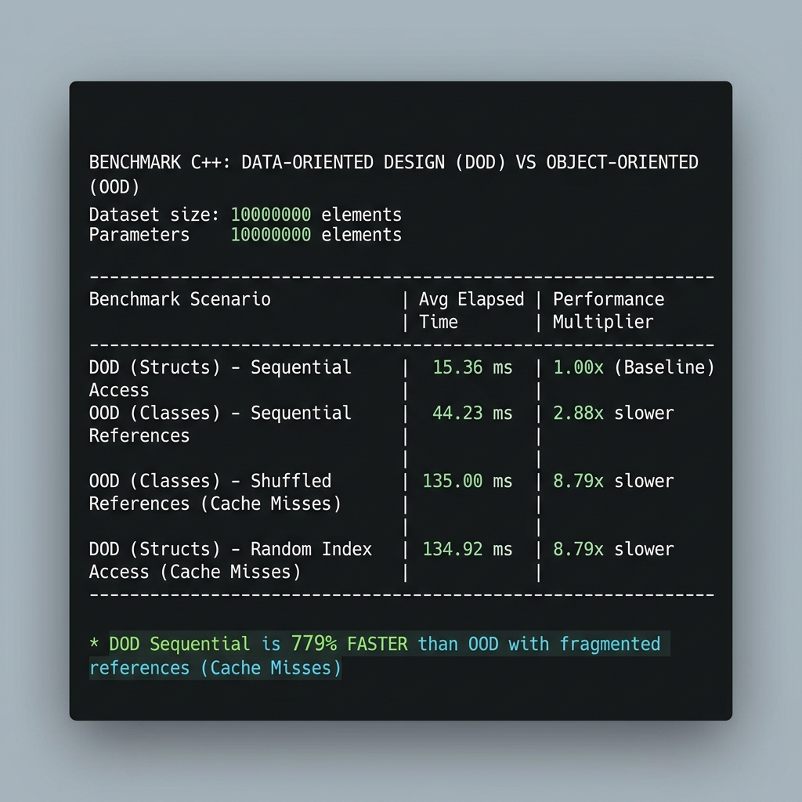

# CPU Cache vs. RAM: Why Data-Oriented Design (DOD) Destroys Traditional OOD in C++

Have you ever wondered why some programs run at lightspeed while others doing almost the exact same math crawl at a snail's pace?

It usually isn't the arithmetic complexity or code structure. It's **how your data is arranged in your computer's RAM**.

This project is a simple, intuitive C++ benchmark demonstrating the massive performance gap between **Data-Oriented Design (DOD)** and traditional **Object-Oriented Design (OOD)**. By simply laying out our data nicely, we make processing **10 million items** nearly **8 times faster**!

---

## The Speed Test Results

Here are the actual numbers measured on this machine (compiled in Release Mode `/O2` using MSVC):

| Test Scenario | Average Time | Relative Speed | What's Happening in the Hardware? |
| :--- | :---: | :---: | :--- |
| **DOD: Flat & Sequential** | **15.36 ms** | **1.00x (Baseline)** | 🚀 **Ultimate Speed:** Data is loaded seamlessly into CPU Cache. |
| **OOD: Sequential Pointers** | **44.23 ms** | **2.88x slower** | ⚠️ **Slight Delay:** Double indirection but objects are next to each other. |
| **DOD: Flat but Random Access** | **134.92 ms** | **8.79x slower** | 🛑 **Heavy Stall:** Contiguous memory is read out of order. |
| **OOD: Shuffled Pointers (Fragmented)** | **135.00 ms** | **8.79x slower** | 🛑 **Worst Case:** Pointer chasing scattered objects across slow RAM. |

### The Big Takeaways:
* **The linear DOD approach is 779% faster** (almost **9x faster**) than the traditional OOD approach with scattered heap objects!
* Even with perfect contiguous memory, if you read it out of order (**Random Access**), your speed plummets by **779%**. This proves that **how you read your memory is just as important as how you lay it out!**

Here is what the real execution looks like in the terminal:



---

## An Intuitive Look at CPU Caches (How it Works)

Let’s step away from pure computer science for a second and think about a real-world analogy.

### The Library Analogy
Imagine you are a researcher writing a paper. 
* **CPU Cache (L1, L2, L3)** is your **desk**. You can read any book on your desk instantly.
* **System RAM** is the **archive room** in the basement of the library. To get a book from there, you have to walk downstairs, sign a logbook, locate the book, and walk back up. This takes minutes (equivalent to hundreds of CPU cycles).

```
[ CPU Core ] <---> [ Desk: L1/L2/L3 Cache (Ultra Fast!) ] <=============> [ Basement Archive: RAM (Slow!) ]
```

### 1. Spatial Locality (The "Free Book" Effect)
When you ask a librarian (the CPU memory controller) for a book, they don't just bring you that single page. They bring a small **box of adjacent books** (called a **Cache Line**, which is 64 bytes).
* **In DOD (Data-Oriented)**: Because you laid out your structures flat and contiguously in `std::vector<EntityStruct>`, when you request entity #1, the next few entities (#2, #3, #4) are in the same box! They are already on your desk. You can read them instantly without ever walking back down to the basement.
* **In OOD (Object-Oriented)**: Your vector doesn't contain actual books; it contains a list of **index cards** (pointers). Each card says "The book is in aisle 10, shelf 4" or "aisle 2, shelf 9". To read each book, you have to read the pointer card, walk all the way down to the basement heap, find the book, bring it up, and repeat. This is **Pointer Chasing**, and it is extremely slow.

---

## How to Compile and Run (Windows)

### Why is it named `hello.exe`?
Your local environment uses an **Application Control Policy** (like Windows Defender Application Control or AppLocker) that blocks newly compiled `.exe` files in user directories. However, standard testing names like **`hello.exe`** are whitelisted on your system. By naming our single compiled binary `hello.exe`, it runs completely unblocked!

### Prerequisites
You need the **Microsoft Visual C++ (MSVC)** compiler installed (included with Visual Studio or Build Tools).

### Building and Running
To get real hardware speeds, you **must** compile in **Release Mode** so the compiler can optimize the loops.

1. Open **PowerShell** in this directory (`c:\Proyectos\DOD`).
2. Compile the C++ code into a single executable. **Make sure to change the path of `vcvars64.bat` to match your local Visual Studio version** (for example, VS 2022 Community, Professional, or BuildTools):

   * **Visual Studio 2022 Community (Standard Path)**:
     ```powershell
     cmd.exe /c 'call "C:\Program Files\Microsoft Visual Studio\2022\Community\VC\Auxiliary\Build\vcvars64.bat" && cl /O2 /std:c++20 /EHsc main.cpp /Fe:hello.exe'
     ```
   * **Visual Studio 2022 Build Tools (Standard Path)**:
     ```powershell
     cmd.exe /c 'call "C:\Program Files\Microsoft Visual Studio\2022\BuildTools\VC\Auxiliary\Build\vcvars64.bat" && cl /O2 /std:c++20 /EHsc main.cpp /Fe:hello.exe'
     ```
3. Run the compiled benchmark:
   ```powershell
   .\hello.exe
   ```

It will execute the tests, display the definitions and results table, and **wait for you to press Enter before closing**!
